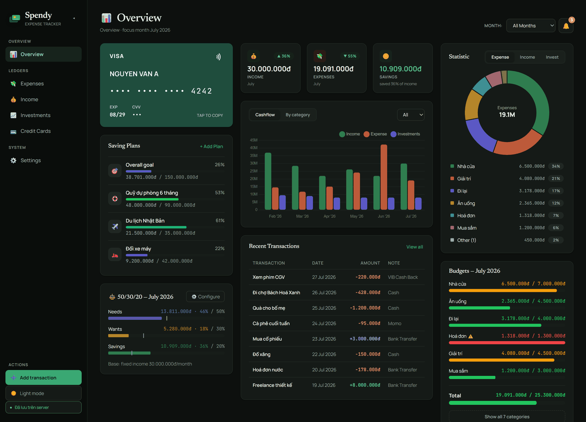
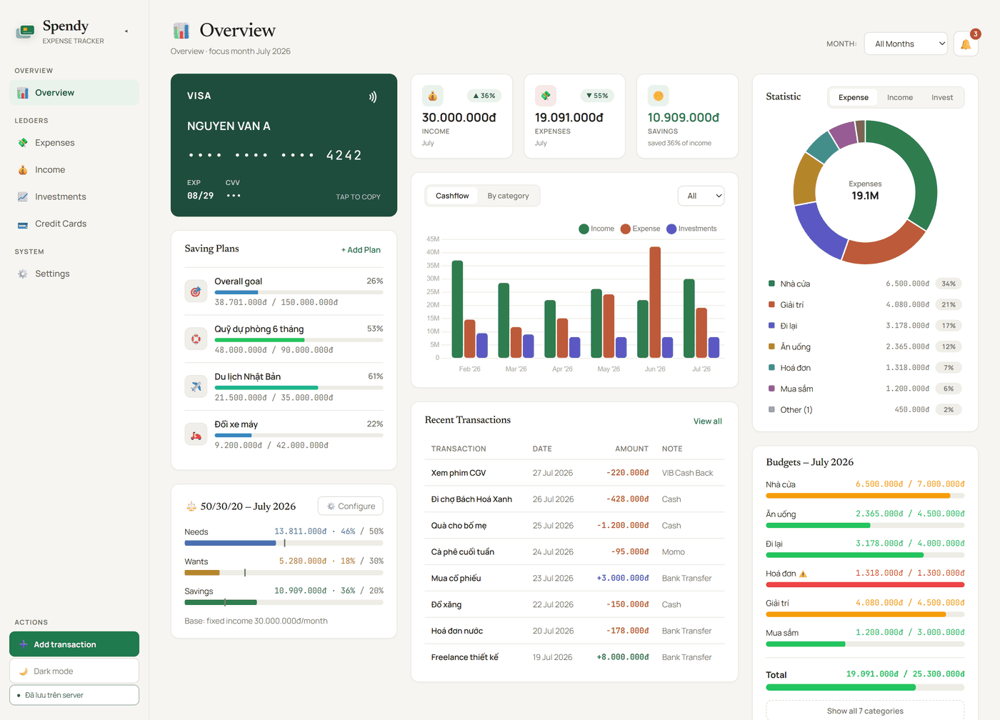
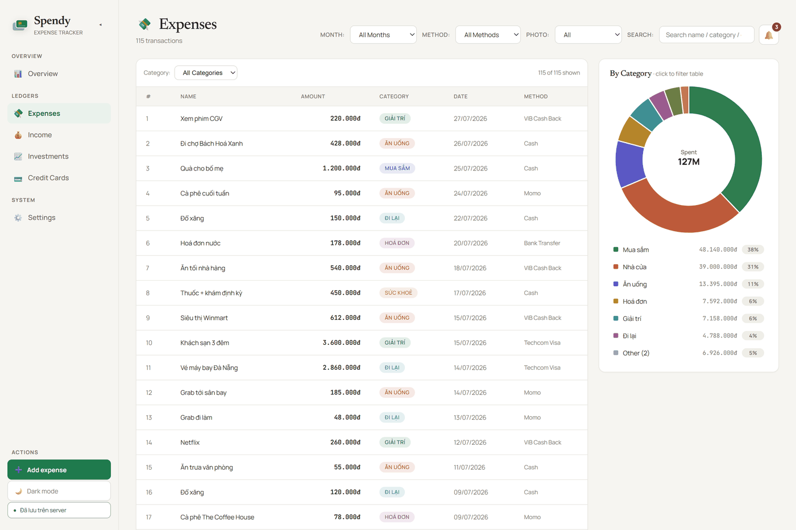
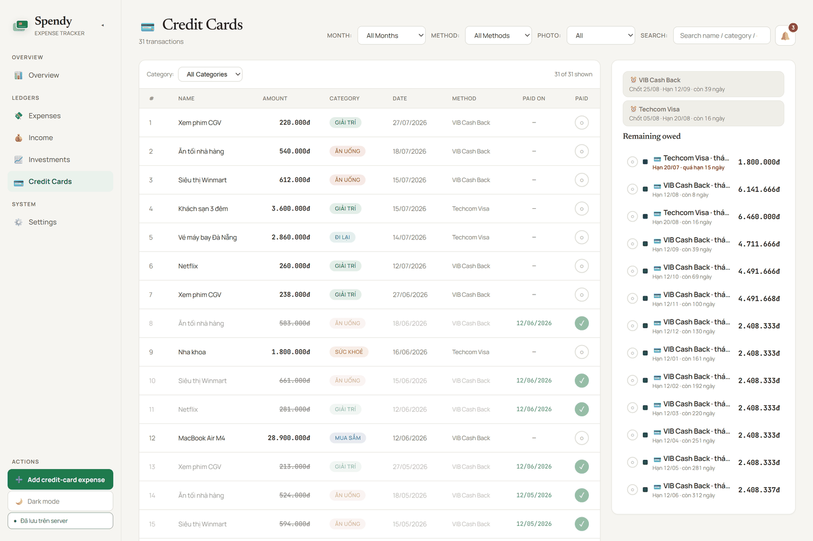
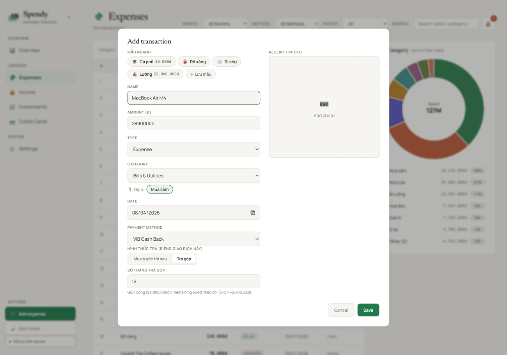
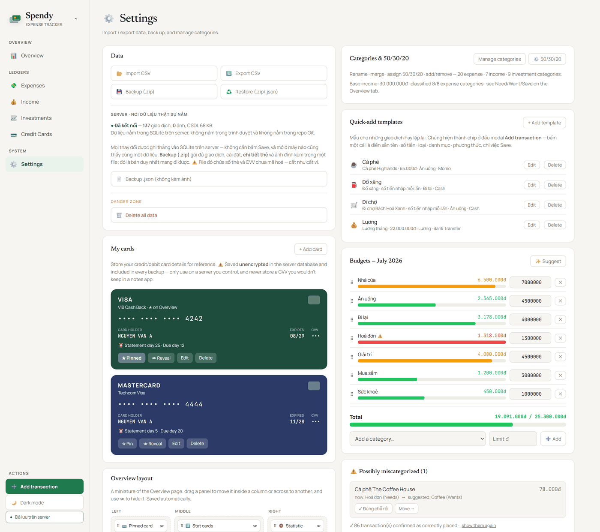
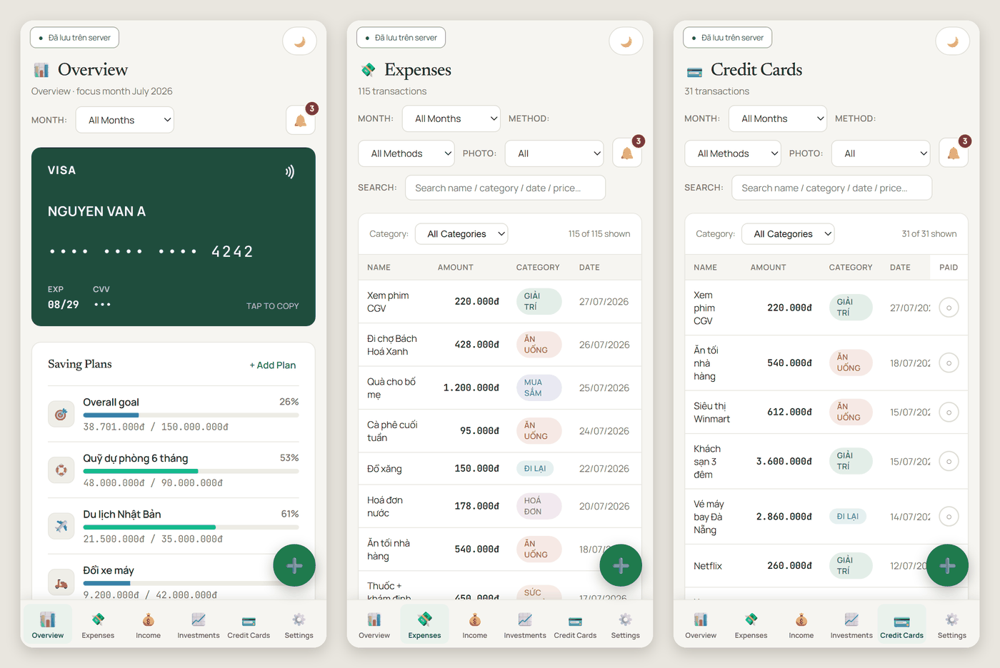

# Spendy

**English** · [Tiếng Việt](README.vi.md)

A **build-free** personal expense tracker you self-host with Docker on your own machine. Amounts are
in **Vietnamese đồng**, and every byte lives on a server you own — a SQLite file plus the receipt
photos beside it — no account, no cloud, nobody else reading it.



The whole application is **three source files**: `Spendy.html` (markup + CSS), `spendy.js` (~3.9k
lines of client logic) and `server/app.py` (~1.9k lines of backend). No `package.json`, no bundler,
no build step, no test runner. The backend uses **nothing but the Python standard library** — exactly
18 `import` statements, all stdlib, and `pip install` is never run.

> The UI chrome is in English (tabs, panel headings, buttons), but a fair amount of secondary text —
> toasts, the Settings help copy, the backup/restore dialogs — is still Vietnamese. That's why
> Vietnamese shows up in the screenshots below.

---

## A look around

### Overview — the whole picture on one screen

Overview merges all three money flows (spending / income / investments): your pinned card, saving
plans, the 50/30/20 needs / wants / savings bars, a monthly cashflow chart, recent transactions, a
category doughnut and budget progress. **Drag panels to reorder them or move them between columns,
and hit 👁 to hide one** (Settings → Overview layout) — the layout is yours, not mine.

Light and dark are both first-class. Every colour goes through a CSS variable, chart axes included:



### Three ledgers — Expenses · Income · Investments

Each transaction type gets its own ledger with the same shape: table on the left, doughnut plus
category list on the right. **Click a slice or a category row to filter the table** in place. Search
is **accent-insensitive** — typing `ca phe` finds `Cà phê`.



### Credit Cards — the tab other expense apps don't have

This tab collects everything paid by credit card and answers exactly one question: **how much is
still owed, and by when.**

- The "Remaining owed" panel groups charges by **card × statement cycle**, with a countdown to each
  due date (red when it's close or already past).
- Tick ✓ to mark a statement paid — the **Paid on** column records the day you actually ticked it.
- **An installment purchase is ONE transaction plus a period count**, not N junk rows in your ledger.
  The spending still lands wholly in the month you bought it; the panel virtualises the N periods so
  you can tick them off one at a time.



### Entering a transaction takes seconds

**Quick-add template** chips prefill the shape of a transaction you keep repeating. Type a name and
the app **suggests a category** — your own history first, falling back to a Vietnamese + English
keyword matcher. Pay by card and the *buy-now-pay-later* / *installment* picker appears. Receipts
can be attached as photos.



### Settings — data and configuration in one place

CSV import/export, backup/restore, server status, saved cards, a drag-and-drop budget editor,
quick-add templates, and a **"possibly miscategorized"** detector (hit *✓ correct as-is* and it stops
flagging that name in that category for good).



### Phone

The app is opened from a phone over LAN/Tailscale, so this is a real path, not an afterthought. Below
768px the sidebar becomes a **bottom tab bar**, Add becomes a **round FAB**, and the Credit Cards
"Paid" column is **pinned to the right edge** so it can't scroll out of reach. All of it is plain CSS
— no JS branch, no separate markup.



*(Every figure, name and card number in the screenshots above is fabricated.)*

---

## Quick start

```bash
mkdir -p data && sudo chown -R 10001:10001 data   # the container runs non-root as UID 10001
docker compose up -d                              # → http://127.0.0.1:8765
```

⚠️ **Loopback only by default.** `docker-compose.yml` publishes `${SPENDY_BIND:-127.0.0.1}:8765:8765`,
so straight after `up` **only that machine** can reach it. To use it from your phone or another
computer, create a `.env` next to `docker-compose.yml` and bring it back up:

```bash
SPENDY_BIND=192.168.1.50      # this machine's LAN IP    (at home — good)
# SPENDY_BIND=100.x.y.z       # this machine's Tailscale IP (remote — good)
# SPENDY_BIND=0.0.0.0         # every interface          (ONLY behind a firewall you trust)
```

Running it without Docker, for development:

```bash
SPENDY_DATA=./data python server/app.py     # then open http://127.0.0.1:8765
node --check spendy.js                      # syntax check — there is no test runner
```

Full Debian 12 deployment, including migrating older data: [docs/DEPLOY.md](docs/DEPLOY.md).

⚠️ **It must be served over `http://` by the server** — opening `Spendy.html` directly as `file://`
shows a connection error, because the browser no longer keeps a copy of anything.

## Architecture

**Server-authoritative**: the SQLite database on the server is the single source of truth; the
browser stores no **data** at all (localStorage holds only the theme and the sidebar-collapsed flag).

```text
[CSV / .zip backup] → PapaParse / makeRecord
    ↓  fetch()
[server/app.py]  ── REST /api/*  (Python stdlib, zero dependencies)
    ↓
[SQLite: records + meta + images]  +  [images/<2hex>/<sha256>.<ext>]   ← Docker volume, NEVER in the repo
    ↓  GET /api/state
[spendy.js state] → render() → DOM + Chart.js
```

| File | Role |
|---|---|
| `Spendy.html` | markup + CSS + the anti-flash theme script |
| `spendy.js` | all client logic (~3.9k lines) |
| `server/app.py` | HTTP + REST + SQLite + static file serving (~1.9k lines, **stdlib only**) |
| `server/migrate.py` | loads a legacy `spendy-db.js` / JSON backup into SQLite (has `--dry-run`) |
| `Dockerfile` | `python:3.12-slim`; vendors Chart.js 4.5.1 + PapaParse 5.4.1 behind SHA-256 checks; runs non-root |
| `docker-compose.yml` | one service; `SPENDY_BIND`, `./data:/data` volume, healthcheck |
| `docs/API.md` | the API contract (⚠️ currently drifted from `server/app.py` on CORS, staging TTL and the static-file allow-list — **when they disagree, the code wins**) |
| `docs/DEPLOY.md` | Debian 12 + Docker deployment guide |

Both runtime libraries are **downloaded into the image at build time** (SHA-256 verified), so the
container runs on a LAN with no internet. A plain clone has no `vendor/`, so `Spendy.html` falls back
to a CDN. The three Google Fonts are still fetched from the network, so an offline box falls back to
system fonts — cosmetic only.

## Your data never enters the repo

Everything personal lives in `data/` (mounted as `/data` in the container) and is blocked by
`.gitignore`: `spendy.db`, `images/`, backup files, the legacy `spendy-db.js`. `.dockerignore`
denies everything first and then allow-lists, so the image stays clean too.

⚠️ But **don't `git add -A` blindly**: `.gitignore` only covers what it knows about. Read
`git status` before committing — stray files you leave beside the repo (screenshots, `.docx` notes…)
are matched by no rule at all.

## Import / export / backup

- **Import CSV**: a Notion export, or one of Spendy's own → `handleCSV` → `processRow` → `makeRecord`
- **Export CSV**: 6 columns (`Name`, `Amount`, `Type`, `Date`, `Categories`, `Payment Method`) + UTF-8 BOM
- **Backup (.zip)**: `GET /api/backup.zip` — one file holding **every transaction, every setting, card details and attached photos**
- **Backup (.json)**: the same payload without images, easy to diff as text
- **Restore**: takes both `.zip` and older `.json`. The `.zip` path is **two-phase** — the server
  stages the upload to disk and reports "N new · M duplicate" for you to confirm before a single row
  is written; cancel and nothing happened
- Re-importing a file you just exported is **safe and idempotent** — it reports "0 new · N duplicate" and changes nothing
- Photos are stored by SHA-256 hash, so the same receipt on two transactions costs one file

## Drive it from a script — or from an AI assistant

Everything the UI does goes through a plain REST + JSON API with no auth, no session and no SDK, so
`curl` is a first-class client — and so is an AI agent. Point Claude Code (or any LLM tool that can
make HTTP requests) at [docs/API.md](docs/API.md) and it can read your spending and write
transactions exactly the way the app does: *"how much did I spend on coffee in July"*, *"log
yesterday's 45k coffee"*, *"which statement cycle is still unpaid"*.

```bash
curl -s localhost:8765/api/health                       # {"ok":true,"records":137,"images":0,…}
curl -s localhost:8765/api/state | jq '.records|length' # every record + every setting, in one call

curl -s -X POST localhost:8765/api/records \
  -H 'Content-Type: application/json' -d '{
    "name": "Cà phê", "amount": 45000, "type": "expense",
    "category": "Coffee", "method": "Cash",
    "dateStr": "2026-08-04", "monthKey": "2026-08", "monthLabel": "August 2026",
    "date": 1785772800000,
    "fingerprint": "Cà phê|45000|Coffee|2026-08-04"
  }'
# → 201 {"ok":true,"record":{…,"id":1}}
#   send the identical request again → 409 duplicate, not a second row
```

Two rules a caller has to respect:

- **You compute the `fingerprint`** (`name|amount|category|dateStr`). The server never recomputes it
  and answers `400 missing_fingerprint` if it is absent. It is also the dedup key, which makes
  retrying a failed write safe: a repeat is a `409`, never a duplicate row.
- **Dates are local calendar days.** Send `dateStr` / `monthKey` / `monthLabel` yourself; the server
  copies them verbatim and never derives a date from a timestamp. Omit `monthKey` and the row lands
  in a month literally called `Unknown`.

Reads are served concurrently; every write takes one process-wide lock, and `POST /api/records/bulk`
commits a whole batch in a single transaction.

⚠️ The flip side is the [Security](#security) section below: the same open API means anything that
can reach the port — not only your agent — can do all of the above.

## Design decisions

- **Four transaction types**: `expense` / `income` / `invest` / `debt` — every "spending" calculation
  counts only `expense`, so income, investments and debts all stay out of budgets and 50/30/20
  automatically
- **Deduplication** on `fingerprint = name|amount|category|dateStr`; the server creates a `UNIQUE
  INDEX` at startup, and an inherited database that already contains duplicates falls back to a
  degraded mode (an explicit check on every insert) with a warning in the log
- **Batch writes are one transaction** — a half-imported file is impossible
- **A date is a local calendar day**: the server stores the `dateStr` the client computed, verbatim,
  and **never** re-derives it from a timestamp (the container's timezone is not guaranteed to match
  yours — re-deriving a day on a UTC container would shift every UTC+7 transaction back one)
- **Credit cards + installments**: one record plus `installments`, with the panel virtualising N
  statement cycles you tick off individually
- **Notifications**: card due-date countdowns, over-budget categories, saving plans reaching their goal
- **Amount formatting lives in one function** (`fmt()`) — though the `đ` suffix is also spelled out in
  a handful of form labels and the "did you forget a zero?" warning hardcodes a 1.000đ threshold, so
  switching currency is a small edit rather than a one-liner

## Things to know before you rely on it

- **Dedup swallows genuinely repeated purchases.** Two 25.000đ coffees from the same shop on the same
  day are one transaction; the second is skipped on CSV import, and the Add form refuses it before it
  is even sent (the server backstops the same case with a 409). Vary the name or the amount to keep
  them apart.
- **Restore merges — it cannot roll you back.** Restoring yesterday's backup will *not* remove rows
  you added today. Actually rewinding means Wipe then Restore, and Wipe is irreversible.
- **Deleting a transaction doesn't delete its photo.** The bytes stay on disk; only
  `POST /api/maintenance/gc-images` reclaims them, and no button calls it yet.
- **One person, one tab.** Two browsers open at once will overwrite each other's whole-array settings
  (paid ticks, budget order, saved cards) — last writer wins, silently. Reload before editing on a
  second device.
- **There is no test suite and no CI.** `node --check` and `ast.parse` only prove the files parse.
  Your safety net is a fresh backup, not a green build.
- **The one-off date repair that runs when the app loads assumes your timezone never changes** — if
  you import while your machine is at UTC+7 and later open the app from another timezone, that repair
  can shift those dates by a day.

## Security

**There is no authentication.** Anyone who can reach the port can read every transaction and receipt
photo, reveal your stored card number and CVV, download a complete backup, and call
`DELETE /api/records` to erase everything. No rate limiting, no audit log. That is why compose
**binds `127.0.0.1` by default**; for remote access go through Tailscale/WireGuard and **do not**
port-forward this to the internet.

⚠️ **Every backup is a plaintext card dump** — `spendy-backup.zip`, `.json` and any tarball of
`./data` all contain the card number, expiry and CVV in the clear. Don't drop them into
Drive/Dropbox/email; `gpg -c` first, then `shred` the original (see [docs/DEPLOY.md](docs/DEPLOY.md)).

What *is* handled carefully, on the other hand: static files are served from an **exact-filename
allow-list** (so a stray `spendy-db.js` or `spendy-backup-*.json` sitting beside the app is never
served); SVG attachments are returned as `application/octet-stream` (an SVG opened on the origin that
serves `/api/state` would run script next to your card numbers); restore-zip entries are checked for
`..`, absolute paths and symlinks, and each image must hash to the name it claims; CORS is narrowed
rather than `*`, with cross-site writes refused as 403; request bodies are capped; and the container
runs non-root as UID 10001 with `no-new-privileges`.
